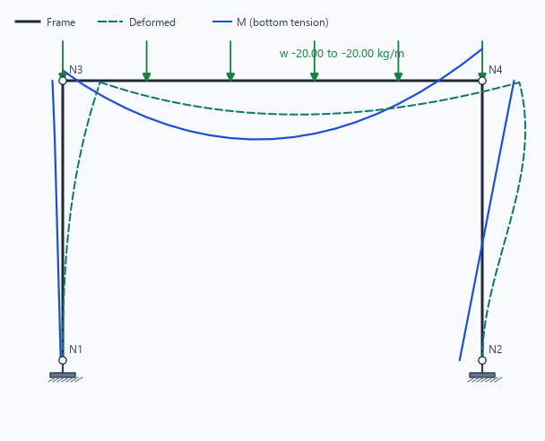
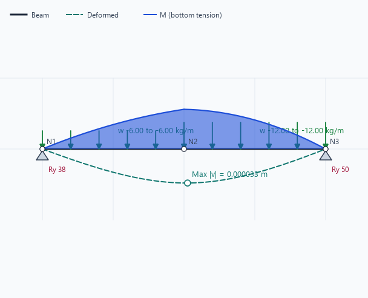
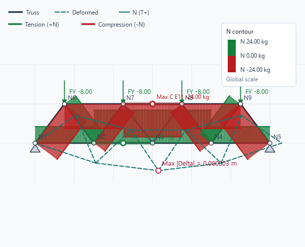
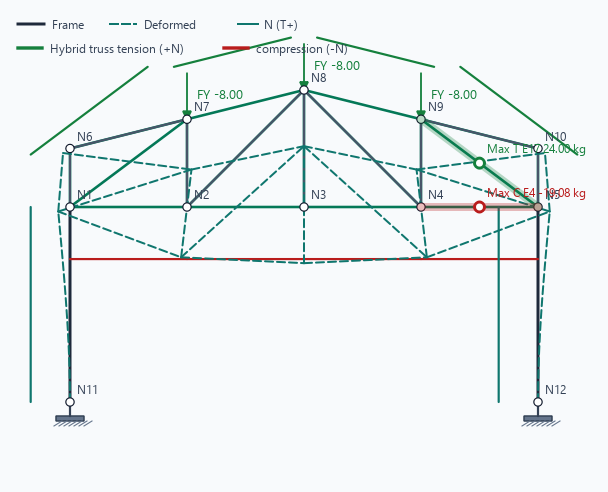

# GO Struct Desktop Manual

## Frame Workspace



Use `Model` tools to create nodes and members, then choose supports and loads from the two-row toolbar.
Run `Analysis`, select a Case or Combination, then switch the result controls to `N`, `V`, `M`, `D`,
`All`, or `FBD`. A Fixed support is shown as a hatched wall; a Pin is shown as a triangle. The report
dialog can export the current result or all load cases/combinations with the canvas image and selected
calculation schedules.

## Beam Workspace



Beam authoring keeps all nodes on one horizontal baseline. Start from Cantilever, Simply Supported, or
Continuous templates, then use `Beam` commands to add spans, insert supports, or resize a selected
span. Intermediate supports in the continuous-beam template are Pinned by default. Select several
spans to apply one uniform load to all of them.

## Truss Workspace



Truss members are pin-jointed and use nodal `Fx/Fy` actions only. `N` is tension-positive: green is
tension and red is compression. The canvas automatically emphasizes the maximum-tension and
maximum-compression members for the active Case or Combination; the same two governing members are
listed in the report. When Contour is enabled, its Palette button can switch between the standard
green/red Truss state, signed blue/red, and spectrum colour maps without changing the solver values.
Use `D` for the exaggerated deflected shape and its maximum displacement marker.

## Hybrid Frame-Truss Workspace



Use `Model > Hybrid Frame-Truss Templates` for Frame columns with Truss chords/webs at common joints.
Frame members carry `N/V/M`; Truss members carry axial `N` only. Choose a flat, sloping, mono, gable,
raised-bottom-chord, or curved profile, then choose Pratt, Howe, Warren, or X-braced web layout. The
current generator is planar 2D with pin-jointed Truss members; its saved template metadata reserves a
future 3D workflow without changing current solver results.

## Reporting

Choose `Report > Export HTML Report` or `Export PDF Report`. In **Report content**, choose the current
result, all load cases and combinations, or all combinations. Canvas figures may be omitted, captured
only from the current canvas result, included as a summary (`Model`, `D`, `FBD`), included in full, or
picked view by view. The capture window shows progress and can be cancelled before a report is written.
Select whether to include model/section/load schedules, node displacement/reaction table, and member
force table. Every selected Case or Combination can receive separate `Model`, `N`, `V`, `M`, `D`, and
`FBD` figures (Truss omits its inapplicable V/M figures). Figures are constrained to the A4 printable
width. Report N/V/M values use four decimal places; geometry remains metres and translational
displacement is millimetres to four decimal places. Envelope is only reported when explicitly selected
as the current result; it does not receive an FBD because an envelope is not one equilibrated load state.

## Regenerating Images

After a visual change, run:

```powershell
.venv\Scripts\python.exe tools\generate_manual_images.py
```
